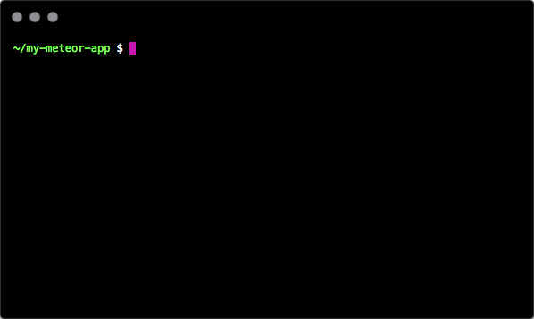

# Meteor Now [](https://circleci.com/gh/mazlix/meteor-now) [](https://badge.fury.io/js/meteor-now)

`meteor-now` is a tool to let you instantly deploy your Meteor apps with one command using ZEIT's [▲now](http://zeit.co/now) service. Just run `meteor-now` and instantly deploy your Meteor app like you could back in the good 'ol days of `meteor deploy`.

<p align="center">
  
</p>

## Demo
https://meteor-now-site-icuqskjceu.now.sh

# Install
Install the `now` and `meteor-now` packages:
```
$ npm install -g now meteor-now
```

Create `now` account
```
$ now --login
> Enter your email: <your email>
> Please follow the link sent to <your email> to log in.
> Verify that the provided security code in the email matches Pragmatic Manta Ray.

✔ Confirmed email address!

> Logged in successfully. Token saved in ~/.now.json
```

# Usage
In your Meteor app directory, run `meteor-now`.
```
~/my-meteor-app/ $ meteor-now
✔ [METEOR-NOW] - building meteor app
✔ [METEOR-NOW] - preparing build
✔ [METEOR-NOW] - deploying build
✔ [METEOR-NOW] - meteor app deployed to https://meteor-test-msrbsvslpz.now.sh
```

# How

`meteor-now` use ZEITs [▲now](https://zeit.co/now) service to deploy the Meteor app in a container. Please refer to their [documentation and support](https://github.com/zeit/) for hosting related details.

# Additional Info
## Full deploy with MongoDB
`meteor-now` lets you to deploy your Meteor app with a MongoDB included similar to how `meteor deploy` used to work. **This method is not intended for production deployments**. In order to achieve this, we bundle your Meteor app and MongoDB into a a single Dockerfile and we instruct your app to connect to the local MongoDB instance. The Dockerfile gets built in the cloud by `now` and once it's ready, the Meteor app will spin up and connect to the MongoDB instance running locally in that docker container.

Some things to keep in mind here is that since MongoDB is installed on the docker container itself, your app data is not persistent and has the chance of getting deleted if a new container is created. Because `now` automatically scales your deployment with load, new docker containers are bound to be created and your is likely going to get lost.

To not have this issue, spin up your own MongoDB instance and pass the `-e MONGO_URL=...` flag when you deploy.
## Using METEOR_SETTINGS
Currently there are two ways you can set the METEOR_SETTINGS environment variable in your deployments

- Using `now secrets`
```
$ now secrets add meteor-settings '{ "public": { "foo": "bar" }}'
$ meteor-now -e METEOR_SETTINGS=@meteor-settings -e MONGO_URL=...
```

- Using `development.settings.json` and `production.settings.json`
Following the convention of the `NODE_ENV` environment variable, `meteor-now` uses `NODE_ENV` to determine which file to look for.
It will either look for `development.settings.json` or `production.settings.json` in your root Meteor directory.

Note that `meteor-now` by default looks for `development.settings.json` unless otherwise specified by `-e NODE_ENV` or `-e METEOR_SETTINGS`.

## Debug
In order to see detailed deployment logs as they happen, pass the `-d` when you deploy.

# Authors
<a href="https://www.github.com/mazlix"></a>|<a href="https://www.github.com/purplecones"></a>
---|---
Justin Krup|Mirza Joldic
[@mazlix](https://www.github.com/mazlix)|[@purplecones](https://www.github.com/purplecones)
