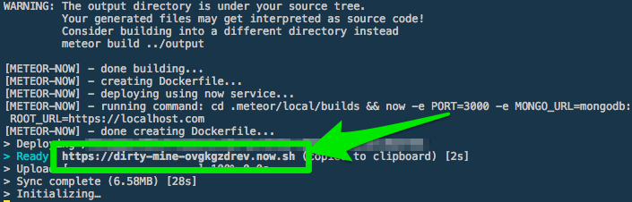

# Meteor Now

`meteor-now` is a tool to let you instantly deploy your Meteor apps with [now](http://zeit.co/now). By using Dockerfile.

It wraps around the now command allowing you to pass in any environment variables as you normally would `now -e`

Just do `meteor-now -e ROOT_URL=http://example.com -e MONGO_URL=mongo://...` and instantly deploy your meteor app like you could back in the good 'ol days of `meteor deploy`

# Example
https://testmet-zioriusvcj.now.sh/

# Usage
Create an account at [https://zeit.co/login](https://zeit.co/login)

Install `now` and `meteor-now` packages:

```
yarn global add now meteor-now
or
npm install -g now meteor-now
```

In your Meteor app directory, run `meteor-now` passing in environment variables according to `now` [docs](https://zeit.co/blog/environment-variables-secrets)
```
meteor-now -e ROOT_URL=http://example.com -e MONGO_URL=mongo://...
```

You will receive a unique link to your deployed app



# Using METEOR_SETTINGS
There are two ways you can set the METEOR_SETTINGS environment variable in your deployments

1. Using `now secrets`
```
now secrets add meteor-settings '{ "public": { "foo": "bar" }}'
meteor-now -e METEOR_SETTINGS=@meteor-settings
```

2. Using `development.settings.json` and `production.settings.json`
Following the convention of the `NODE_ENV` environment varaibe, `meteor-now` uses `NODE_ENV` to determine which file to look for.
It will either look for `development.settings.json` or `production.settings.json` in your root meteor directory.

Note that `meteor-now` will look for `development.settings.json` by default unless `NODE_ENV` is set to production or METEOR_SETTINGS was passed in as a result of the first option above.

# Authors
Justin Krup [@mazlix](https://github.com/mazlix)
Mirza Joldic [@purplecones](https://github.com/purplecones)
